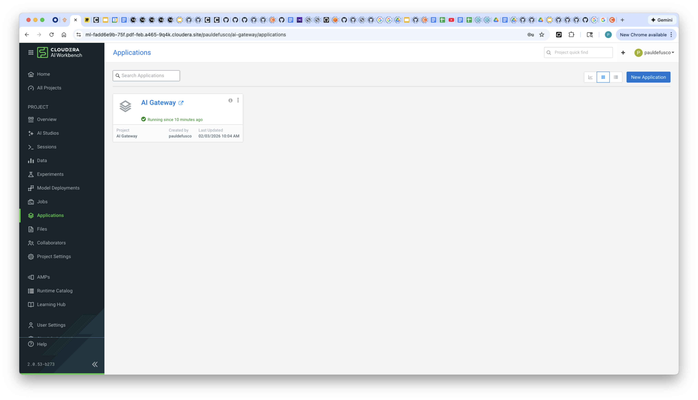
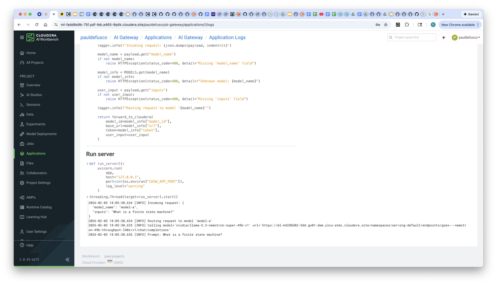
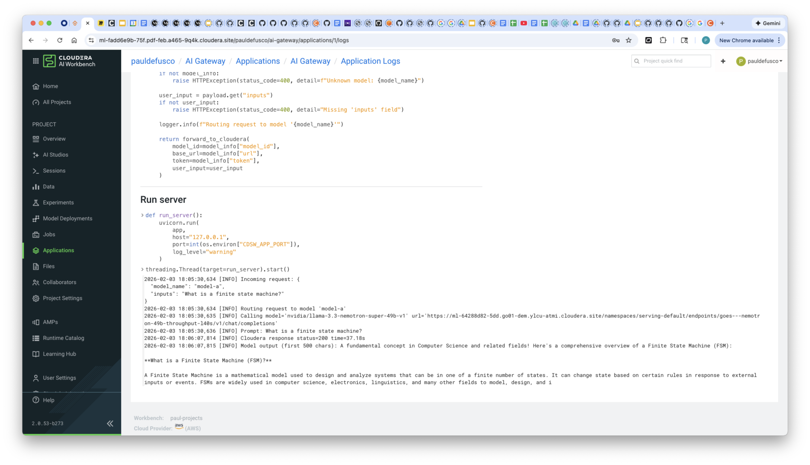
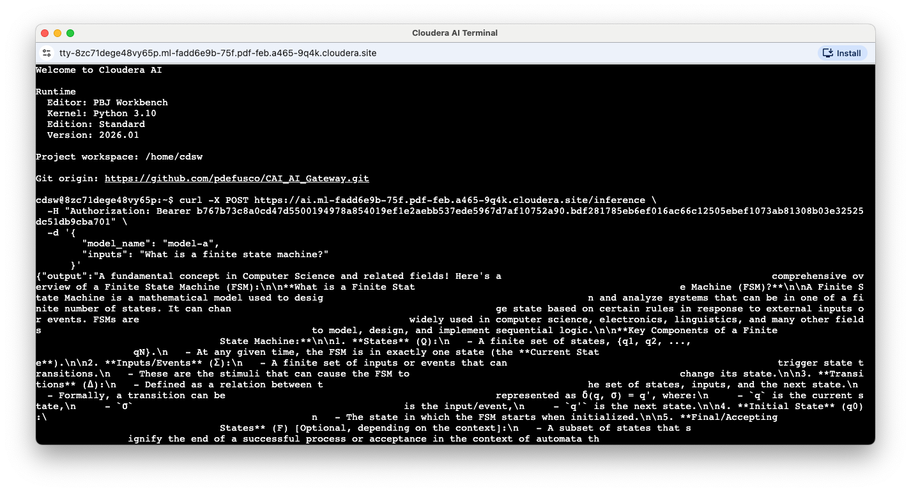

# AI Gateway in Cloudera AI

## Objective

This project demonstrates how to deploy an AI Gateway in Cloudera AI as a CAI application.

## Motivation

An AI gateway is an architectural layer that mediates access between client applications and one or more AI model endpoints. Rather than interacting with models directly, consumers send requests to the gateway, which is responsible for selecting the appropriate model, forwarding the request, and returning a normalized response.

Beyond simple routing, an AI gateway addresses several practical and operational concerns that arise as AI systems scale. It centralizes authentication and credential management, preventing model-specific keys and endpoints from being exposed to downstream services. It provides a consistent API contract, allowing applications to switch models or providers without code changes. Gateways also enable observability —logging inputs, outputs, latency, and errors— which is essential for debugging, auditing, and cost control. In more advanced setups, they enforce rate limiting, traffic shaping, and policy controls, and can implement fallback or load-balancing strategies across models.

In short, an AI gateway decouples application logic from model infrastructure, making AI systems more secure, maintainable, and adaptable as models, vendors, and deployment environments evolve.

## Setup

Create a CAI Project with PBJ Python 3.10 runtime.

Launch a CAI Session with PBJ Python 3.10 runtime and install requirements.

```
pip3 install -r requirements.txt
```

Deploy the application with the ```gateway.py``` script.



## Usage

Open a CAI Session and from the terminal send the following requests.

Test endpoint liveliness:

```
curl -X GET \
     -H "Authorization: Bearer <YOUR-APP-KEY-HERE>" \
     https://ai.ml-fadd6e9b-75f.pdf-feb.a465-9q4k.cloudera.site/ping
```

If you get a "200 OK" response, this means your gateway is running.

You can now proceed with a model request:

```
curl -X POST https://ai.ml-fadd6e9b-75f.pdf-feb.a465-9q4k.cloudera.site/inference \
  -H "Authorization: Bearer <YOUR-APP-KEY-HERE>" \
  -d '{
        "model_name": "model-a",
        "inputs": "What is a finite state machine?"
      }'
```

Validate in backend logs:







## Summary & Next Steps

This demo showcased a hybrid AI multi-agent system operating across on premises and cloud environments. The on prem and cloud agents communicated via the Agent-to-Agent (A2A) protocol, exchanging a formal contract that defined authorized data access. Using this framework, the system safely executed user requests while enforcing governance and security policies.

In this Text to SQL scenario, the cloud agent generated queries for the approved table, the on prem agent executed them, and the results were returned in natural language, demonstrating how A2A enables secure, collaborative AI workflows across hybrid infrastructures.

You built this in Cloudera AI leveraging two Nvidia Nemotron 49B endpoints, LangGraph, and the Cloudera AI Inference Service. This tutorial can serve as a reusable template for use cases leveraging A2A across environments.

**Additional Resources & Tutorials**

Explore these helpful tutorials and blogs to learn more about Cloudera AI, the AI Registry, and AI Inference Service:

1. **Cloudera AI Inference Service – Easy Integration & Deployment**
   A technical deep dive into how Cloudera’s inference service enables GenAI integration in production: ([Reddit][1], [Cloudera][2])

2. **Deploy & Scale AI Applications with Cloudera AI Inference Service**
   Official Cloudera blog covering general availability, hybrid support, and GPU acceleration: ([Cloudera][3])

3. **Cloudera Introduces AI Inference Service With NVIDIA NIM**
   Explains how NVIDIA NIM microservices are embedded, + details on AI Registry integration: ([Cloudera][4])

4. **Scaling AI Solutions with Cloudera: Inference & Solution Patterns**
   A deep technical walkthrough on deploying AI at scale, including RAG workflows with LLaMA models: ([Cloudera][5], [Reddit][6])

5. **How to Use Model Registry on Cloudera Machine Learning**
   Community guide focused specifically on registering, versioning, and managing models: ([community.cloudera.com][7])

6. **Cloudera AI Inference Service Overview (docs)**
   Official documentation outlining architecture, APIs (OpenAI & standard protocols), GPU support, and registry integration: ([Cloudera][2])

[1]: https://www.reddit.com/r/LlamaIndex/comments/1f4nqvc?utm_source=chatgpt.com "[Tutorial] Building Multi AI Agent System Using LlamaIndex and Crew AI!"
[2]: https://www.cloudera.com/blog/technical/cloudera-ai-inference-service-enables-easy-integration-and-deployment-of-genai.html?utm_source=chatgpt.com "Elevating Productivity: Cloudera Data Engineering Brings External IDE Connectivity to Apache Spark | Blog | Cloudera"
[3]: https://www.cloudera.com/blog/business/deploy-and-scale-ai-applications-with-cloudera-ai-inference-service.html?utm_source=chatgpt.com "Deploy and Scale AI Applications With Cloudera AI Inference Service | Blog | Cloudera"
[4]: https://cloudera.com/blog/business/cloudera-introduces-ai-inference-service-with-nvidia-nim.html?utm_source=chatgpt.com "Cloudera Introduces AI Inference Service With NVIDIA NIM | Blog | Cloudera"
[5]: https://www.cloudera.com/blog/technical/scaling-ai-solutions-with-cloudera-a-deep-dive-into-ai-inference-and-solution-patterns.html?utm_source=chatgpt.com "Scaling AI Solutions with Cloudera: A Deep Dive into AI Inference and Solution Patterns | Blog | Cloudera"
[6]: https://www.reddit.com/r/learnmachinelearning/comments/1cn1c3u?utm_source=chatgpt.com "Fine-tune your first large language model (LLM) with LoRA, llama.cpp, and KitOps in 5 easy steps"
[7]: https://community.cloudera.com/t5/Community-Articles/How-to-use-Model-Registry-on-Cloudera-Machine-Learning/ta-p/379812?utm_source=chatgpt.com "How to use Model Registry on Cloudera Machine Lear... - Cloudera Community - 379812"
