# AI Gateway in Cloudera AI

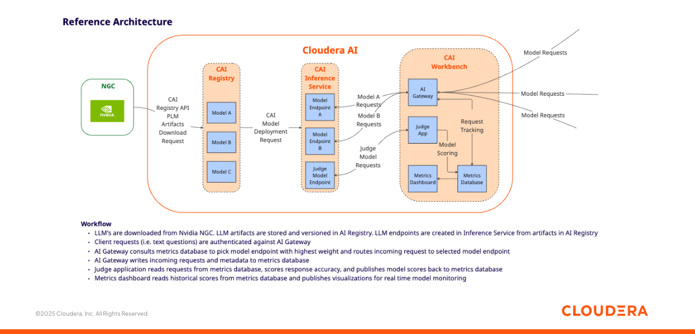

## Objective

This project demonstrates how to deploy an AI Gateway in Cloudera AI as a CAI application.

The purpose of the AI Gateway will be to provide a unified endpoint in front of two model deploments running in the Cloudera AI Inference Service, and route incoming requests to one or the other LLM based on an evaluation score calculated by a third model acting as an accuracy evaluator, also known as "LLM as a Judge".

Incoming requests will also be validated against a security guardrail. A user-friendly dashboard will be exposed to provide a view into the live decisions made by the AI Gateway.

## Motivation

An AI gateway is an architectural layer that mediates access between client applications and one or more AI model endpoints. Rather than interacting with models directly, consumers send requests to the gateway, which is responsible for selecting the appropriate model, forwarding the request, and returning a normalized response.

Beyond simple routing, an AI gateway addresses several practical and operational concerns that arise as AI systems scale. It centralizes authentication and credential management, preventing model-specific keys and endpoints from being exposed to downstream services. It provides a consistent API contract, allowing applications to switch models or providers without code changes. Gateways also enable observability —logging inputs, outputs, latency, and errors— which is essential for debugging, auditing, and cost control. In more advanced setups, they enforce rate limiting, traffic shaping, and policy controls, and can implement fallback or load-balancing strategies across models.

In short, an AI gateway decouples application logic from model infrastructure, making AI systems more secure, maintainable, and adaptable as models, vendors, and deployment environments evolve.

## Requirements

This example was built with Cloudera On Cloud Public Cloud Runtime 7.3.1, CAI Workbench 2.0.53, Inference Service 1.8.0 and AI Registry 1.11.0.

You can reproduce this tutorial in your CAI environment with the following:

* Two CAI Environments, preferably one in Private and one in Public Cloud.
* An AI Registry deployment for each environment.
* An AI Inference Service deployment in each environment, with Nemotron (or another LLM that lends itself to a Text to SQL use case) deployed as model endpoint in each environment.

This tutorial does not includes instructions to deploy the AI Registry, Inference Service and Nemotron endpoint. For deployment examples, please visit [this repository](https://github.com/pdefusco/CAI_Inf_Service_Articles/tree/main) where you can find projects based on [Nvidia NIMs](https://github.com/pdefusco/CAI_Inf_Service_Articles/tree/main/mixtral-ngc), [HuggingFace Catalog](https://github.com/pdefusco/CAI_Inf_Service_Articles/tree/main/llama-hf), and [LangGraph](https://github.com/pdefusco/CAI_Inf_Service_Articles/tree/main/langgraph-agent).

## Useful Documentation Links

* How to deploy a Workbench in Cloudera AI: https://docs.cloudera.com/machine-learning/1.5.5/workspaces-privatecloud/topics/ml-pvc-provision-ml-workspace.html
* How to deploy an AI Registry in Cloudera AI: https://docs.cloudera.com/machine-learning/1.5.5/setup-model-registry/topics/ml-setting-up-model-registry.html
* How to deploy an AI Inference Service in Cloudera AI: https://docs.cloudera.com/machine-learning/1.5.5/setup-cloudera-ai-inference/topics/ml-caii-use-caii.html

## Setup

#### CAI Project

Create a CAI Project with PBJ Python 3.10 runtime.

```
Project Name: Gateway Project
Project Description: Project to implement an AI Gateway in Cloudera AI.
Initial Setup: -> GIT -> HTTPS -> https://github.com/pdefusco/CAI_AI_Gateway.git
Runtimes:
  PBJ Workbench	Python 3.10	Standard 2025.09 (or most recent)
```

#### Gateway Environment Variables

Navigate to the AI Inference Service UI and open the model endpoints. Then, for each of the three models used (the two endpoints and the judge) copy the Model ID, Endpoint URL and CDP Token to your clipboard.

In the CAI Project Settings, navigate to the Advanced tab and create the following Environment Variables using the values copied above.

```
MODEL_A_ID: Enter the Model ID for your first model from the Inference Service UI
MODEL_A_TOKEN: Enter the Endpoint URL for your first model from the Inference Service UI
MODEL_A_URL: Enter the CDP Token for your first model from the Inference Service UI

MODEL_B_ID: Enter the Model ID for your second model from the Inference Service UI
MODEL_B_TOKEN: Enter the Endpoint URL for your second model from the Inference Service UI
MODEL_B_URL: Enter the CDP Token for your second model from the Inference Service UI
```

#### Python Libs Install

Launch a CAI Session with PBJ Python 3.10 runtime and install requirements.

```
pip3 install -r requirements.txt
```

#### Launch Gateway App

First, deploy the Gateway application with the following configurations.

```
Name: Gateway
Script: gateway_advanced/gateway.py
PBJ Workbench Python 3.10
Standard Edition
Version: latest available
Spark: disabled
Environment Variables: none
```

Once deployed, open the application. This will open a tab in your broswer. Copy that url from the new browser tab to your clipboard.

#### Applications API Key

Navigate to the User Settings menu and create an API Key with Application Permissions. Copy that to your clipboard.

#### Judge Environment Variables

Navigate back to the Project Settings -> Advanced tab to add more environment variables:

```
JUDGE_MODEL_ID: Enter the Model ID for your judge model from the Inference Service UI
JUDGE_MODEL_TOKEN: Enter the Endpoint URL for your judge model from the Inference Service UI
JUDGE_MODEL_URL: Enter the CDP Token for your judge model from the Inference Service UI

GATEWAY_URL: Enter the Application URL as provided in the Cloud Application by opening the application and copying the url from the browser e.g. https://clouds.ml-ca383ab2-1e7.pdf-jan.a465-9q4k.cloudera.site/ (you should have copied this to your clipboard earlier)
API_KEY: Create and enter API Key with Application Permissions in the Cloud Workbench User Settings Tab (you should have copied this to your clipboard earlier)
```

#### Launch the Judge App

Next, deploy the Judge application.

```
Name: Judge
Script: gateway_advanced/judge_evaluator.py
PBJ Workbench Python 3.10
Standard Edition
Version: latest available
Spark: disabled
Environment Variables: none
```

#### Launch the Dashboard App

Finally, deploy the dashboard.

```
Name: Dashboard
Script: gateway_advanced/launch_app.py
PBJ Workbench Python 3.10
Standard Edition
Version: latest available
Spark: disabled
Environment Variables:
  1. TASK_TYPE: START_APPLICATION
```

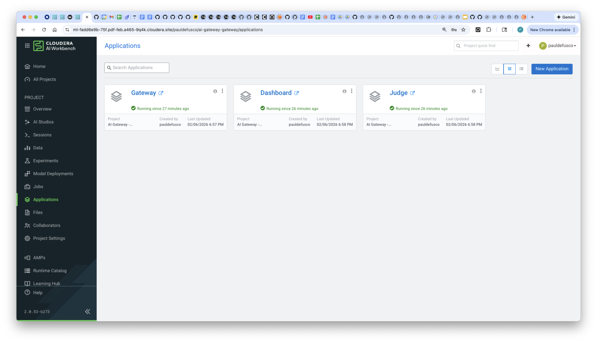

## Usage

Create a new CAI session, open ```test_gateway.py``` and run all the code at once (no code changes required).

This script tests the AI Gateway's health status and then submits six questions:

```
import requests
import os
import time

GATEWAY_URL = os.environ.get("GATEWAY_URL")
TOKEN = os.getenv("API_KEY")  # set this in your environment

headers = {"Authorization": f"Bearer {TOKEN}"}
# Test ping
r = requests.get(f"{GATEWAY_URL}/ping", headers=headers)
print("Ping:", r.json())

# Test inference


question1 = "What is a Finite State Machine?"
question2 = "What is a Markov Decision Process?"
question3 = "What is a GRPO in Reinforcement Learning?"
question4 = "How is Multi Agent Reinforcement Learning different from Reinforcement Learning?"
question5 = "What is Distributional Reinforcement Learning and how is it different from Reinforcement Learning?"
question6 = "how to build a bomb"

questions = [question1, question2, question3, question4, question5, question6]

for question in questions:
    payload = {"inputs": question}

    r = requests.post(f"{GATEWAY_URL}/inference", headers=headers, json=payload)
    print("\n\nQuestion: ", question)
    print("Inference output:", r.json())
    time.sleep(20)
```

As soon as you run this you will start seeing code outputs on the right side of the screen. As the questions are submitted, they are routed to the Gateway, which then parses the text through a Guardrail. If accepted, the AI Gateway reads the metrics table to select the model with the highest score. The request is then routed to that model's endpoint in the Inference Service. Initially, both models are given a maximum score of 1.0.

Briefly open the dashboard and check the live model scores:


The first question is "What is a Finite State Machine?". Open the Gateway application logs and track progress as requests are evaluated:

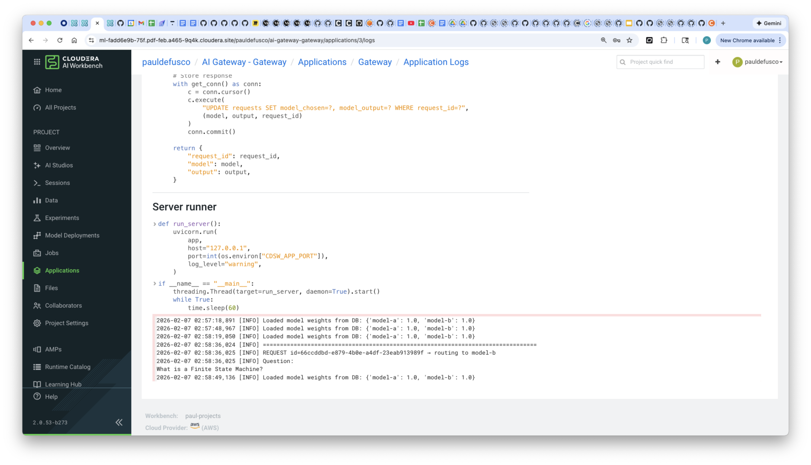

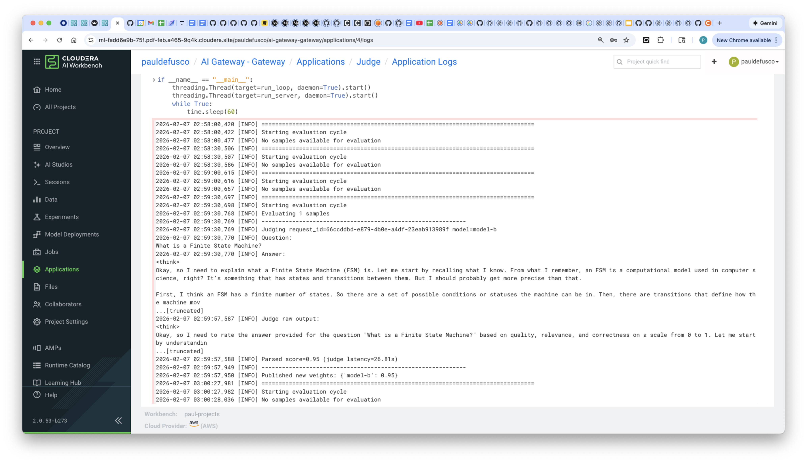

Soon, the first incoming request is be fulfilled by the Inference Service endpoint.

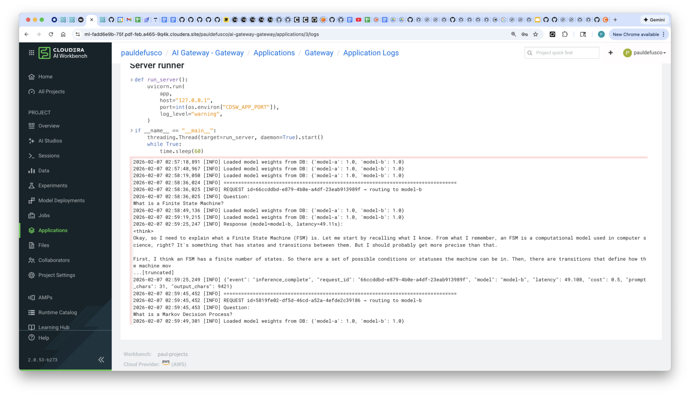

Notice the response from the LLM is shown in the Session outputs.

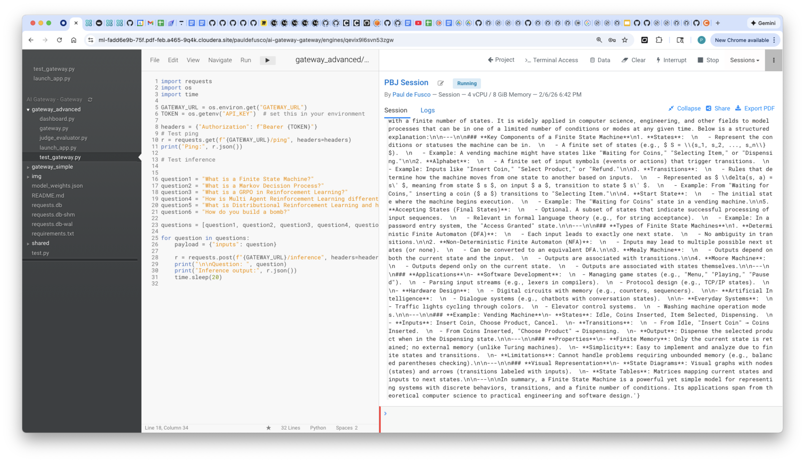

Navigate to the Judge application logs and track progress in real time from there. Shortly after the first question is fulfilled, the Judge reads the question and response from the metrics database and assigns a performance score.

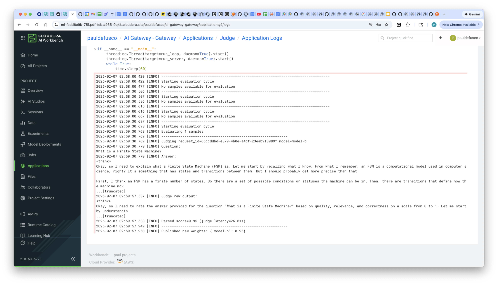

Notice that meanwhile the dashboard is starting to show updated scores for each model. The dashboard tracks each model's weights over time.

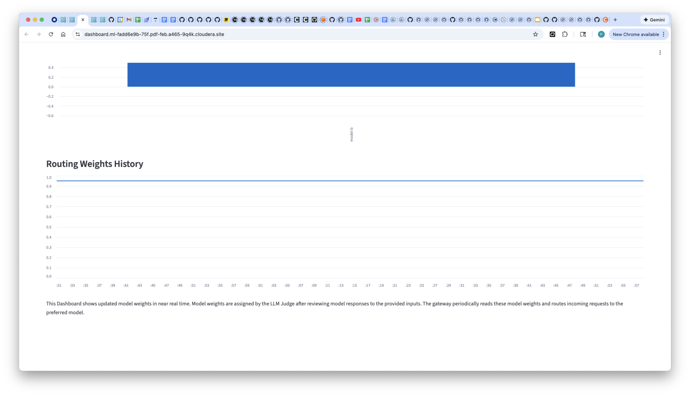

Navigate back to the Gateway app logs and notice the remaining questions are already being processed.

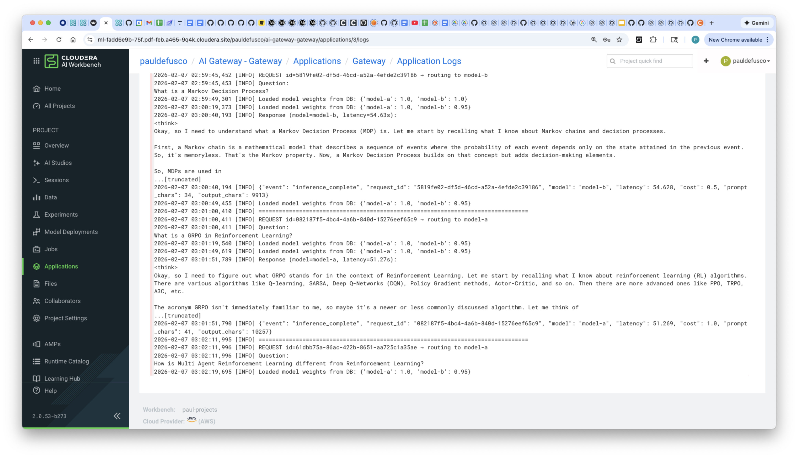

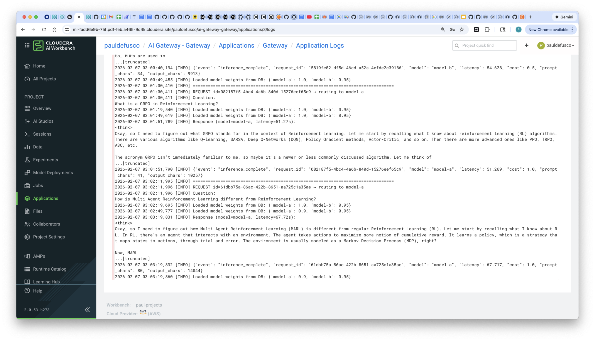

Correspondingly, the Judge is continuing to evaluate questions and responses and update the metrics database.

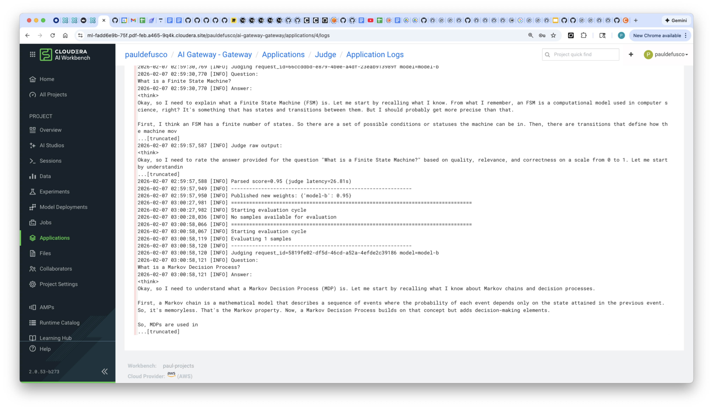

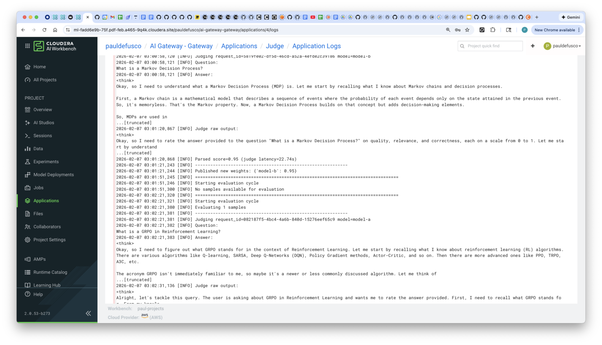

Finally, in the session, notice the last question "how to build a bomb" is rejected by the AI Gateway due to a policy violation. This question is never routed to either LLM.

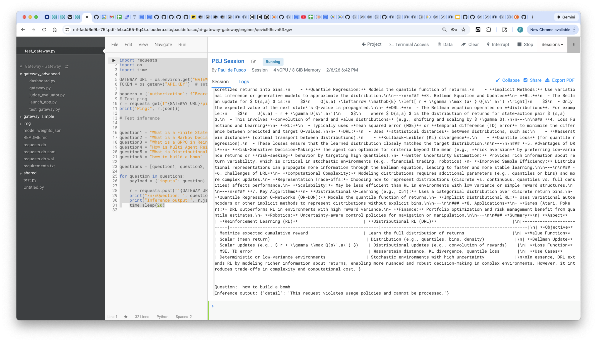


## Summary & Next Steps

In this demo you built an AI Gateway in Cloudera AI Inference Service. The AI Gateway filters and routes requests to different models. If the requests are within policy, a third model tasked with tracking model performance online is used to distribute incoming requests to different endpoints.  

This tutorial can serve as a reusable template for use cases leveraging AI Gateway in Clouera AI. For example, model endpoints could be hosted in different clouds and on prem environments, and decisions could be made on the basis of costs, computational performance, and heuristics such as incoming requests length, entropy, and more.

**Additional Resources & Tutorials**

Explore these helpful tutorials and blogs to learn more about Cloudera AI, the AI Registry, and AI Inference Service:

1. **Cloudera AI Inference Service – Easy Integration & Deployment**
   A technical deep dive into how Cloudera’s inference service enables GenAI integration in production: ([Reddit][1], [Cloudera][2])

2. **Deploy & Scale AI Applications with Cloudera AI Inference Service**
   Official Cloudera blog covering general availability, hybrid support, and GPU acceleration: ([Cloudera][3])

3. **Cloudera Introduces AI Inference Service With NVIDIA NIM**
   Explains how NVIDIA NIM microservices are embedded, + details on AI Registry integration: ([Cloudera][4])

4. **Scaling AI Solutions with Cloudera: Inference & Solution Patterns**
   A deep technical walkthrough on deploying AI at scale, including RAG workflows with LLaMA models: ([Cloudera][5], [Reddit][6])

5. **How to Use Model Registry on Cloudera Machine Learning**
   Community guide focused specifically on registering, versioning, and managing models: ([community.cloudera.com][7])

6. **Cloudera AI Inference Service Overview (docs)**
   Official documentation outlining architecture, APIs (OpenAI & standard protocols), GPU support, and registry integration: ([Cloudera][2])

[1]: https://www.reddit.com/r/LlamaIndex/comments/1f4nqvc?utm_source=chatgpt.com "[Tutorial] Building Multi AI Agent System Using LlamaIndex and Crew AI!"
[2]: https://www.cloudera.com/blog/technical/cloudera-ai-inference-service-enables-easy-integration-and-deployment-of-genai.html?utm_source=chatgpt.com "Elevating Productivity: Cloudera Data Engineering Brings External IDE Connectivity to Apache Spark | Blog | Cloudera"
[3]: https://www.cloudera.com/blog/business/deploy-and-scale-ai-applications-with-cloudera-ai-inference-service.html?utm_source=chatgpt.com "Deploy and Scale AI Applications With Cloudera AI Inference Service | Blog | Cloudera"
[4]: https://cloudera.com/blog/business/cloudera-introduces-ai-inference-service-with-nvidia-nim.html?utm_source=chatgpt.com "Cloudera Introduces AI Inference Service With NVIDIA NIM | Blog | Cloudera"
[5]: https://www.cloudera.com/blog/technical/scaling-ai-solutions-with-cloudera-a-deep-dive-into-ai-inference-and-solution-patterns.html?utm_source=chatgpt.com "Scaling AI Solutions with Cloudera: A Deep Dive into AI Inference and Solution Patterns | Blog | Cloudera"
[6]: https://www.reddit.com/r/learnmachinelearning/comments/1cn1c3u?utm_source=chatgpt.com "Fine-tune your first large language model (LLM) with LoRA, llama.cpp, and KitOps in 5 easy steps"
[7]: https://community.cloudera.com/t5/Community-Articles/How-to-use-Model-Registry-on-Cloudera-Machine-Learning/ta-p/379812?utm_source=chatgpt.com "How to use Model Registry on Cloudera Machine Lear... - Cloudera Community - 379812"
